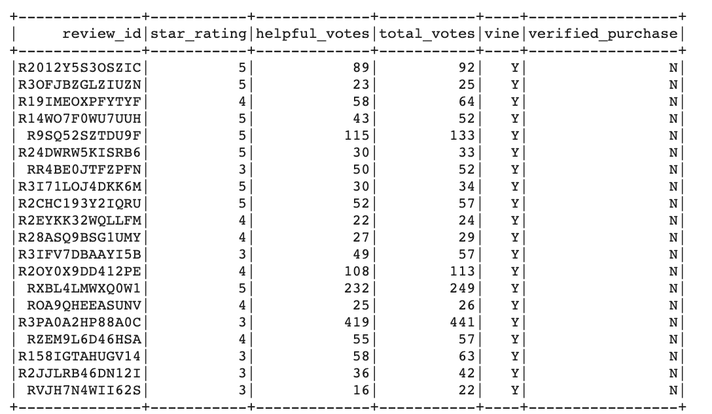
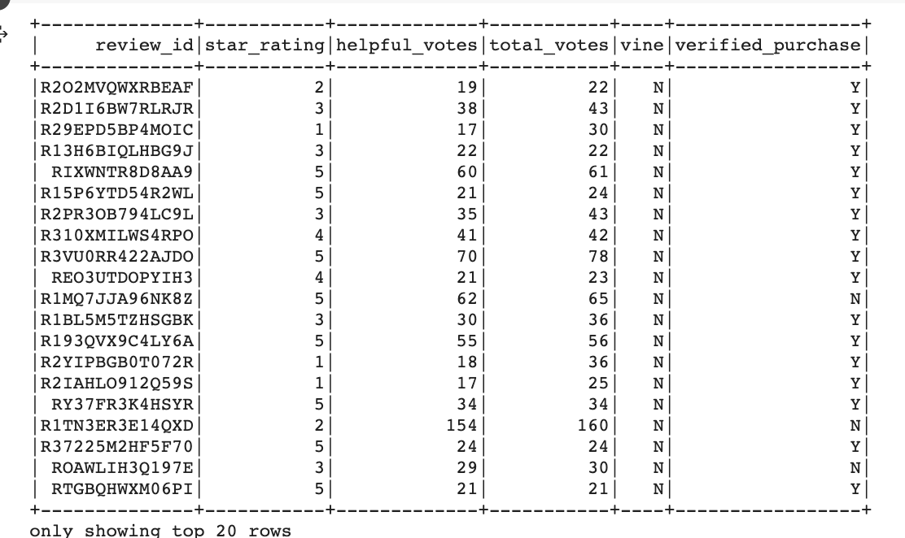
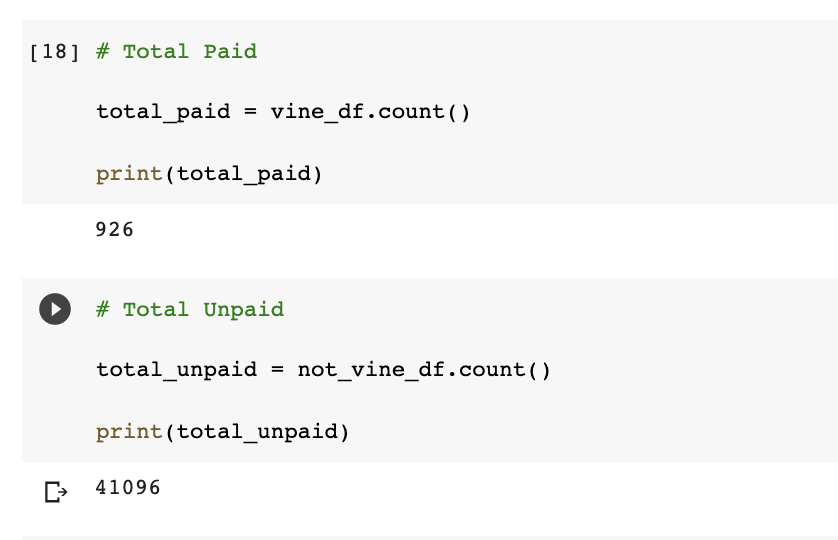
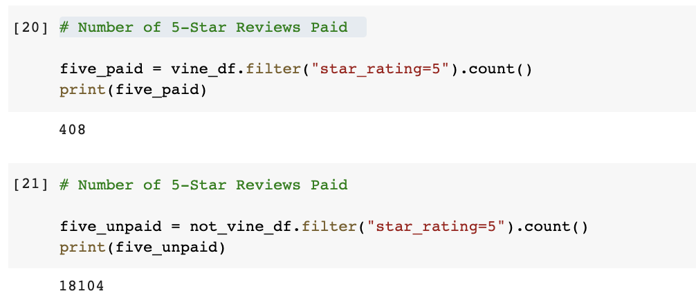
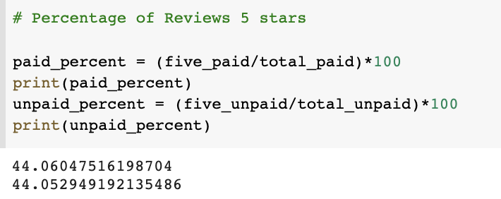

# Amazon_Vine_Analysis

## Overview 

The purpose of this analysis of reviews for office products on Amazon -is to identify if paying for product reviews introdices bias from review authors. 

  

## Results 
The results of the analysis were as follows: 

- There were a total of 926 paid and 41,096 unpaid reviews for these products. 

- There were 408 paid and 18,104 unpaid 5-star reviews for these products. 

 

- When looking at the percent of paid and unpaid reviews that were 5-stars, we see that both result in about 44% reviews for all 5-stars 

 

## Summary 
Summary: In your summary, state if there is any positivity bias for reviews in the Vine program. Use the results of your analysis to support your statement. Then, provide one additional analysis that you could do with the dataset to support your statement.
